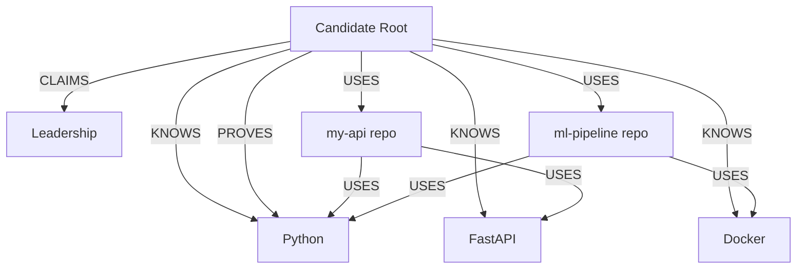

# Knowledge Graph

## Overview

The Knowledge Graph is a **relational graph** stored in PostgreSQL that models relationships between candidates, skills, projects, platforms, and evidence. It uses `SkillGraphNode` and `SkillGraphEdge` tables to represent a directed property graph without requiring a dedicated graph database.

## Graph Schema

### Node Types (`GraphNodeType`)

| Type | Description |
|------|-------------|
| `SKILL` | A technology, language, framework, or concept |
| `PROJECT` | A GitHub repository or portfolio project |
| `PLATFORM` | A coding platform (GitHub, LeetCode, Codeforces) |
| `EVIDENCE` | A root/candidate node or evidence anchor |

### Relationship Types (`GraphRelationshipType`)

| Relationship | Meaning | Example |
|-------------|---------|---------|
| `KNOWS` | Candidate has demonstrated knowledge | Candidate → Python |
| `USES` | Project uses a technology | `my-api` → FastAPI |
| `IMPLEMENTS` | Repository implements a framework | `web-app` → React |
| `PROVES` | Platform evidence proves a skill | GitHub → Python |
| `CLAIMS` | Resume claims a skill (unverified) | Resume → Leadership |

## Graph Structure



## Database Models

### `skill_graph_nodes`

| Column | Type | Description |
|--------|------|-------------|
| `id` | UUID PK | Node identifier |
| `candidate_profile_id` | UUID FK | Owner candidate |
| `node_type` | Enum | SKILL, PROJECT, PLATFORM, EVIDENCE |
| `name` | String(255) | Node label |
| `properties` | JSONB | Arbitrary metadata |
| `created_at` / `updated_at` / `deleted_at` | Timestamptz | Audit columns |

### `skill_graph_edges`

| Column | Type | Description |
|--------|------|-------------|
| `id` | UUID PK | Edge identifier |
| `candidate_profile_id` | UUID FK | Owner candidate |
| `source_node_id` | UUID FK → nodes | Edge start |
| `target_node_id` | UUID FK → nodes | Edge end |
| `relationship_type` | Enum | KNOWS, USES, IMPLEMENTS, PROVES, CLAIMS |
| `properties` | JSONB | Edge metadata (e.g. evidence text, source) |

## Graph Construction Pipeline

1. **Purge** — Delete existing nodes and edges for the candidate (idempotent rebuild)
2. **Create Candidate Root** — EVIDENCE-type node as the graph anchor
3. **Create Skill Nodes** — One SKILL node per extracted skill
4. **Link KNOWS** — Candidate Root → each Skill via KNOWS edge
5. **Link Evidence** — CLAIMS edges for resume evidence, PROVES edges for platform evidence
6. **Create Project Nodes** — One PROJECT node per GitHub repository
7. **Link USES** — Candidate → Project and Project → Technology edges

## API Access

The graph is built as part of the full evaluation pipeline triggered by:

```
POST /api/v1/analyze/skills
```

Graph data can be retrieved via the `KnowledgeGraphService.get_graph()` method which returns serialized nodes and edges.

## Key Files

| File | Purpose |
|------|---------|
| `app/database/models/skill_graph.py` | SkillGraphNode and SkillGraphEdge ORM models |
| `app/services/knowledge_graph_service.py` | Graph construction and retrieval service |
| `app/database/models/enums.py` | GraphNodeType and GraphRelationshipType enums |
